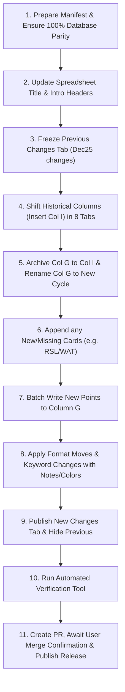

# Update Points Sheet (X-Wing 2.0 Legacy)

## 1. Overview & Purpose
This skill maintains the official **X-Wing 2.0 Legacy Points Retrospective Document** hosted on Google Sheets (Default Spreadsheet ID: `1kgEwq-1UtA7w8Q5sXAr_bt0AZHfaaZDnVRC9lnyAoBY`).

While [`update-xwing-data2-legacy`](file:///p:/xwing-data2-legacy/.agents/skills/update-xwing-data2-legacy/SKILL.md) updates the canonical JSON files in the git repository, this skill ensures the public-facing retrospective spreadsheet stays in exact 100% parity with the database, clearly displaying point changes and historical trends to players and tournament organizers.

---

## 2. Spreadsheet Architecture

The document is organized into several tab categories:

### 2.1 Informational & Technical Tabs
* **`Introduction`** (Index 0): Welcome message, format descriptions, links, and an explanatory sample header row demonstrating the layout.
* **`Calculate Summary`** (Index 1 — **Hidden Technical Tab**):
  - Used by the sheet maintainer/agent to aggregate changes across all 8 faction/generic tabs.
  - Powered by a single dynamic Query formula in `A1`:
    ```excel
    =Arrayformula(query({
      To_Text('Generic upgrades'!A3:I);
      To_Text('Rebel Alliance'!A4:I);
      To_Text('Galactic Empire'!A4:I);
      To_Text('Scum and Villiany'!A4:I);
      To_Text(Resistance!A4:I);
      To_Text('First Order'!A4:I);
      To_Text('Galactic Republic'!A4:I);
      To_Text('Separatist Alliance'!A4:I)
    }; "select Col2, Col3, Col7, Col8, Col9 where (Col8 > 0 or Col7 <> Col9) or Col8 contains 'changed'";))
    ```
  - *Must always remain hidden from regular users.*

### 2.2 Public Changes Tabs (`[Cycle] changes`)
* **Current Changes Tab** (e.g. `Mar26 changes`):
  - Visible tab placed immediately after `Calculate Summary`.
  - Populated with **static values** (no formulas) copied from `Calculate Summary` after an update.
* **Historical Changes Tabs** (e.g. `Dec25 changes`, `Mar24 changes`, `Sep23 changes`):
  - Archived past update snapshots.
  - *Must be hidden (`hidden: true`) when superseded by a new update.*

### 2.3 The 8 Faction & Upgrade Points Tabs
1. `Generic upgrades`
2. `Rebel Alliance`
3. `Galactic Empire`
4. `Scum and Villiany`
5. `Resistance`
6. `First Order`
7. `Galactic Republic`
8. `Separatist Alliance`

---

## 3. Faction Tab Column Structure & Invariants

Every faction and upgrade tab follows a strict columnar layout:

| Col | Field | Content & Invariant Rules |
| :---: | :--- | :--- |
| **A** | **Format** | `Standard`, `Epic`, or `Wild Space` |
| **B** | **Type** | Ship Chassis Name (e.g. `T-65 X-wing`) or Upgrade Slot (e.g. `Talent (E)`, `Crew (W)`) |
| **C** | **Name** | Pilot or Upgrade card name. Unique cards prefixed with bullets: `•` (single), `••` (double), `•••` (triple). Customizable LSL / print-and-play cards use suffixes like `(PnP)`, `(LSL)`, `(BoY)`, `(BoE)`. |
| **D** | **Upgrade Bar** | Slot letter codes for pilots (e.g. `ESCCPmnt`). |
| **E** | **Restrictions** | Card restrictions (e.g. `Rebel, Scum`, `Small ship`, `Dark side`). |
| **F** | **Keywords** | Card keywords (e.g. `TIE`, `B-wing`, `Spectre`). |
| **G** | **Current Points** | Points for the current update cycle. Header row 3 is the cycle name (e.g. `Mar 26`). Row 2 is `X2PO`. |
| **H** | **Change vs previous** | Dynamic difference formula comparing Col G vs past history. Formula:<br>`=IF(ISNUMBER(INDEX(I4:4; MATCH(FALSE; ISBLANK(I4:4); 0))); G4-INDEX(I4:4; MATCH(FALSE; ISBLANK(I4:4); 0)); "")` |
| **I** | **Previous Points** | Points from the immediate previous cycle (e.g. `Dec 25`). Row 2 is `X2PO`. |
| **J+** | **Historical Points** | Columns `J`, `K`, `L`... store older updates in descending chronological order (`Mar 25`, `Sep 24`, `Mar 24`, etc.). |

---

## 4. End-to-End Update Lifecycle

When a points update occurs (e.g. moving from `Dec 25` to `Mar 26`):



### Step 1: Ensure 100% Database Parity
All pilots and upgrades in `xwing-data2-legacy` must be present in the sheet.
- New pilots/upgrades (e.g. RSL, WAT, Wild Space releases) must be appended to their respective faction or generic tabs with format `Wild Space`, correct restrictions, Column G = new points, Column I = release/previous points, and Column H = difference formula.

### Step 2: Freeze Previous Changes Tab
- Locate the previous changes tab (e.g. `Dec25 changes`).
- If it still contains dynamic formulas, read its evaluated values, clear the sheet, and write back plain static text (`valueInputOption: "RAW"`).
- Set its property `hidden: true`.

### Step 3: Shift Historical Columns
For each of the 8 faction & upgrade tabs:
1. Insert 1 new column at index 8 (Column `I`) using `insertDimension` (`COLUMNS`). This pushes previous history rightwards (Col I becomes J, J becomes K, etc.).
2. Copy values from Column G into Column I:
   - Cell `I2` = `"X2PO"`
   - Cell `I3` = Previous Cycle Name (e.g. `"Dec 25"`)
   - Cells `I4:I<end>` = Previous point values from Column G.
3. Update Cell `G3` to New Cycle Name (e.g. `"Mar 26"`).
4. Refresh Column H formulas to ensure they reference `I`:
   `=IF(ISNUMBER(INDEX(I<row>:<row>; MATCH(FALSE; ISBLANK(I<row>:<row>); 0))); G<row>-INDEX(I<row>:<row>; MATCH(FALSE; ISBLANK(I<row>:<row>); 0)); "")`

### Step 4: Batch Update Column G (Points)
Apply updated point values to Column G for all changed cards. Format variable costs according to the standard convention:
- **Base Size Variable**:
  ```text
  Base Size
  Small=2 /
  Med=4 /
  Large=7
  ```
- **Initiative Variable**:
  ```text
  Initiative
  0=5 / 1=5 /
  2=5 / 3=7 /
  4=7 / 5=7 / 6=7
  ```

### Step 4b: Apply Format (Column A) & Keyword (Column F) Updates
When a balance update includes format/gamemode movements or keyword adjustments:
1. **Format Moves (Column A)**:
   - Update Column A cell value to the new format (e.g., `"Standard"`).
   - Add a cell note describing the change and effective date: e.g., `"Moved to Standard format (September 2026)"`.
   - Set cell background color to soft blue (`#C8DAF8` / `{ red: 0.784, green: 0.855, blue: 0.973 }`) to visibly indicate the state change.
2. **Keyword Changes (Column F)**:
   - Update Column F cell value to include the new keyword (e.g., `"Clone"` → `"Clone, TIE"`).
   - Add a cell note with effective date: e.g., `'Added "TIE" keyword (September 2026)'`.
   - Set cell background color to soft blue (`#C8DAF8`).

### Step 5: Publish New Changes Tab
1. Ensure `Calculate Summary!A1` formula encompasses all 8 tabs (starting at row 3 for `Generic upgrades`, row 4 for all factions).
2. Duplicate the template changes tab into the new cycle tab (e.g. `Mar26 changes`) at sheet index 2.
3. Read the evaluated values from `Calculate Summary!A1:E<end>` and paste into `Mar26 changes` as static text.
4. Set `Mar26 changes` to `hidden: false`.
5. Set `Calculate Summary` to `hidden: true`.
6. Set previous changes tab (e.g. `Dec25 changes`) to `hidden: true`.

### Step 6: Update Introduction & Document Title
- Update spreadsheet title to `X-Wing 2.0 Legacy Points document ([Month] [Year])`.
- Update `Introduction` row 5 sample headers (`G5` = new cycle, `I5` = previous cycle).

### Step 7: Pull Request & Release Creation
Following verification of the database and spreadsheet:
1. Push branch to remote and create a Pull Request targeting `master`.
2. **Manual Confirmation**: Prompt the user to confirm when the PR has been reviewed and merged into `master`.
3. Once confirmed by the user, pull `master` and create the GitHub Release & tag (aligned with semantic version without `v` prefix) via the release script:
   ```bash
   node .agents/skills/update-xwing-data2-legacy/scripts/create_release.js <PR_NUMBER> "<Month Year> Points Update"
   ```

---

## 5. Tooling & Automation Scripts

The skill provides ready-to-run automation tools located in [`scripts/`](file:///p:/xwing-data2-legacy/.agents/skills/update-points-sheet/scripts/):

### 5.1 Run Automated Update
```bash
node .agents/skills/update-points-sheet/scripts/update_points_sheet.js <manifestPath> <newCycle> <prevCycle>
# Example:
node .agents/skills/update-points-sheet/scripts/update_points_sheet.js .agents/skills/update-xwing-data2-legacy/scripts/march_2026_points_manifest.json "Mar 26" "Dec 25"
```

### 5.2 Validate Points Sheet
```bash
node .agents/skills/update-points-sheet/scripts/verify_points_sheet.js <manifestPath>
```
Validates:
- Document title matches current cycle.
- `Calculate Summary` and archived changes tabs are properly hidden.
- The new changes tab is visible and populated.
- All 8 faction tabs have correct Column G and Column I headers.
- 100% agreement between `Calculate Summary` and points-changed manifest cards (0 missing cards, 0 unexpected changes).
- Verification of Column A format changes and Column F keyword changes, including cell notes and background color.

---

## 6. Edge Cases & Matching Guidelines

### 6.1 Gamemode & Format Moves (`"MOVE TO STANDARD"` / `"MOVED"`)
- **Balance Sheet Identification**: Entries in the Collation column indicating format updates (e.g. `"MOVE TO STANDARD"`, `"MOVED"`, `"MOVE TO EXTENDED"`).
- **Database Action**: Toggle `"standard": true` (or `false`) in the pilot's ship file under `data/pilots/<faction>/<ship>.json`.
- **Spreadsheet Action**:
  - Update Column A (*Format*) to `"Standard"`.
  - Add a cell note stating the movement and effective date: e.g. `"Moved to Standard format (September 2026)"`.
  - Apply soft blue background color (`#C8DAF8` / `{ red: 0.784, green: 0.855, blue: 0.973 }`).
- **`Calculate Summary` Behavior**: Cards that *only* change format without a points change have equal values in Column G and Column I (`Col7 == Col9`), producing a difference of 0 in Column H. Hence, they are not selected by the `Calculate Summary` query. Cards that change *both* format and points (e.g. `Antoc Merrick`, `FN-2187`, `“Strife”`) will appear in `Calculate Summary` as expected.

### 6.2 Keyword Changes (`ADD "<KEYWORD>"` / `"REMOVE <KEYWORD>"`)
- **Balance Sheet Identification**: Collation entries indicating keyword changes (e.g., `35, ADD "TIE" KEYWORD`).
- **Database Action**:
  - Add or remove the keyword from the `keywords` array in the ship JSON file.
  - **Audit all card faces**: Check both customizable LSL (`<xws>-lsl`) and Standard Loadout SL (`<xws>`) versions of the pilot card to ensure keywords remain consistent across chassis variants (e.g. `klick-siegeofcoruscant`).
- **Spreadsheet Action**:
  - Update Column F (*Keywords*) to include the keyword (e.g. `"Clone"` → `"Clone, TIE"`).
  - Add a cell note with effective date: e.g. `'Added "TIE" keyword (September 2026)'`.
  - Apply soft blue background color (`#C8DAF8`).

### 6.3 Disambiguation, Typos & Multi-Variant Cards
1. **Source Sheet Typos**:
   Balance spreadsheets maintained by committee members frequently contain slight spelling discrepancies compared to canonical database names:
   - Pilot name typos: `Depa Billoba` → `Depa Billaba`, `Essara Rill` → `Essara Till`, `Rhys Dallow` → `Rhys Dallows`, `OOM Uplink Prototype` → `00-M Uplink Prototype` (zeros vs capital O's).
   - Chassis name differences: `Upsilon-class Shuttle` → `Upsilon-Class Command Shuttle`, `Vulture-class Droid Fighter` → `Vulture-class Droid Starfighter`.
2. **Customizable (LSL) vs Standard Loadout (SL) Cards**:
   - Community balance records and tournament points almost exclusively adjust the **customizable / LSL** version of pack pilots (e.g. `•Iden Versio (BoY)` at 64 → 54 pts, `•Scythe 6 (BoE)` at 42 → 34 pts).
   - In faction tabs, customizable LSL pilots are listed near the top of the chassis group (with labels like `(BoY)`, `(BoE)`, `(SoC)` or `(PnP)`), while fixed Standard Loadout cards are grouped at the bottom under Epic / Wild Space with `(BoY SL)` or `(BoE SL)`.
   - Never apply standard points updates to the fixed Standard Loadout rows unless explicitly specified.
3. **Cross-Chassis Pilot Names**:
   - Generic and unique pilots can appear across multiple ship types (e.g., `Garven Dreis` on `T-65 X-wing` vs `ARC-170 Starfighter`). Always check the ship chassis (`Type`) column before applying updates.


